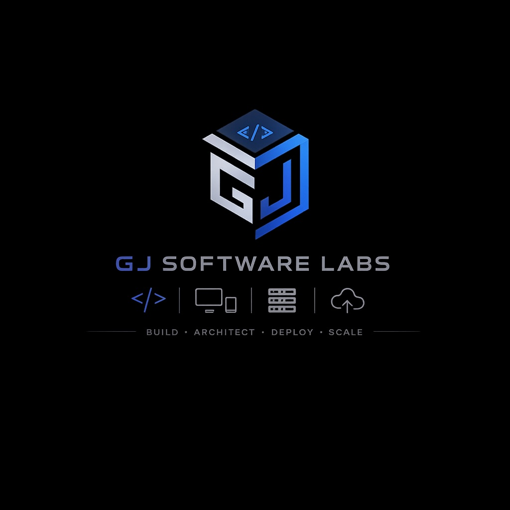

<div align="center">

<br/>


# GJ Software Labs

### *Premium Web & App Development*

<br/>

[](https://gjsoftwarelabs.com/)
[](https://wa.me/917218296592)
[](https://gjsoftwarelabs.com/contact)

<br/>

> **Taking local businesses online within their budget.**
> Professional, end-to-end software engineering — fast, beautifully designed, and built to scale.

<br/>

---

</div>

## ✦ Who We Are

**GJ Software Labs** is a boutique software engineering studio that specializes in delivering **premium-quality, production-ready software** for local businesses and startups — without the bloated agency fees.

As a **sole founder & engineer**, you deal **directly** with the person building your product. No account managers. No communication bottlenecks. Just clean code, pixel-perfect design, and real accountability.

<br/>

## ⚡ End-to-End Capabilities

From your user's screen to the cloud infrastructure behind it — we build across every major platform.

<br/>

| Platform | What We Build |
|---|---|
| 🌐 **Web Development** | Responsive, high-performance web apps with Next.js & React |
| 🍎 **iOS Apps** | Native & cross-platform apps for iPhones and iPads |
| 🤖 **Android Apps** | Robust mobile applications for the entire Android ecosystem |
| 🖥️ **macOS & Windows** | Powerful desktop software with deep OS integration |
| 🐧 **Linux Software** | Reliable, performant apps for Linux environments & servers |
| ☁️ **Backend & Cloud** | Secure, scalable APIs, databases & cloud infrastructure |

<br/>

---

## 💡 Why GJ Software Labs?

<br/>

```
✅  Direct access to the engineer building your product
✅  No bloated agency fees or middlemen
✅  Top-tier engineering with full personal accountability
✅  Premium design quality within your budget
✅  End-to-end delivery — from concept to deployment
```

<br/>

---

## 🛠️ Tech Stack

<br/>


<br/>

---

## 📬 Get In Touch

Ready to take your business online? Let's build something great together.

<br/>

<div align="center">

[](https://gjsoftwarelabs.com/contact)
&nbsp;&nbsp;
[](https://wa.me/917218296592)

<br/>
<br/>

🔗 [Website](https://gjsoftwarelabs.com/) &nbsp;•&nbsp; [Services](https://gjsoftwarelabs.com/#services) &nbsp;•&nbsp; [About](https://gjsoftwarelabs.com/#about) &nbsp;•&nbsp; [Privacy](https://gjsoftwarelabs.com/privacy) &nbsp;•&nbsp; [Terms](https://gjsoftwarelabs.com/terms)

<br/>



<br/>

---

<sub>Designed & Developed with ❤️ by <strong>GJ Software Labs</strong> · © 2026 · All Rights Reserved</sub>

</div>
